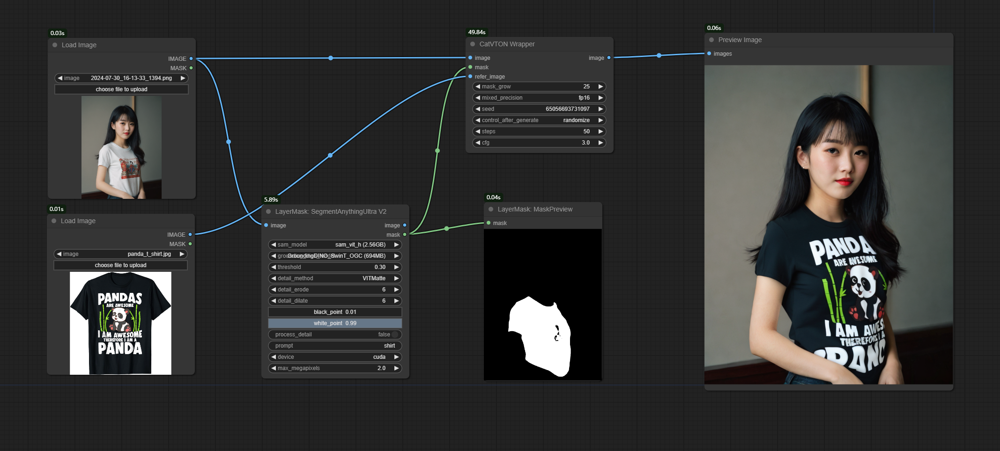
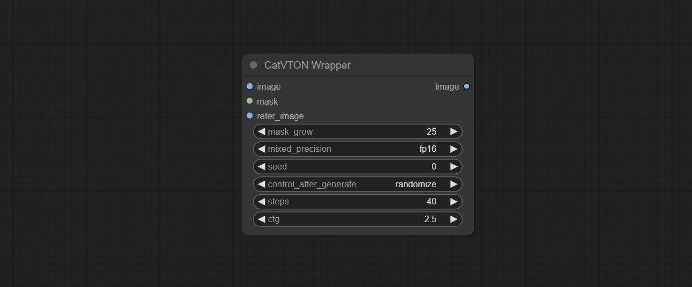

# ComfyUI_CatVTON_Wrapper

Concatenation Is All You Need for Virtual Try-On with Diffusion Models.    

Original repo: [https://github.com/Zheng-Chong/CatVTON](https://github.com/Zheng-Chong/CatVTON)    

     

### Install Plugin
Open the cmd window in the plugin directory of ComfyUI, like ComfyUI\custom_nodes，type:
```
git clone https://github.com/chflame163/ComfyUI_CatVTON_Wrapper.git
```

### Install Dependency Packages
Open the cmd window in the ComfyUI_CatVTON_Wrapper plugin directory like ComfyUI\custom_ Nodes\ComfyUI_CatVTON_Wrapper and enter the following command,    

For ComfyUI official portable package, type:
```
..\..\..\python_embeded\python.exe -s -m pip install -r requirements.txt
```
For Aki ComfyUI package, type:
```
..\..\python\python.exe -s -m pip install -r requirements.txt
```
### Download Modes
Down model files from [BaiduNetdisk](https://pan.baidu.com/s/1QuIgWF8EnISCnovku9nZ1g?pwd=y0n0 ) and copy to ```ComtyUI/models/CatVTON``` directory. 

### Example Workflow
The example workflow files in the workflow directory.

### Node Options
      
* image: The input image.
* mask: The mask of input image, clothing within the mask range will be repaint.
* refer_image: The reference image of repaint clothing.
* mask_grow: The size of the mask expansion. If the repaint clothing style is incorrect, try adjusting this value.
* mixed_precision: fp32, fp16, bf16 can be selected, the model will run under the selected data type.
* seed: The random seed of sampler.
* steps: The number of steps of sampler.
* cfg: The cfg strength of the diffusion model.

### statement
Please refer to the original project license to authorization agreement.

